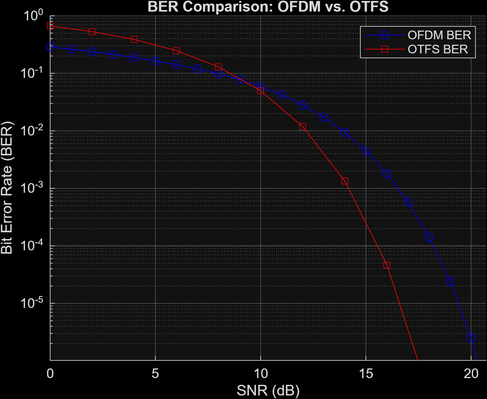
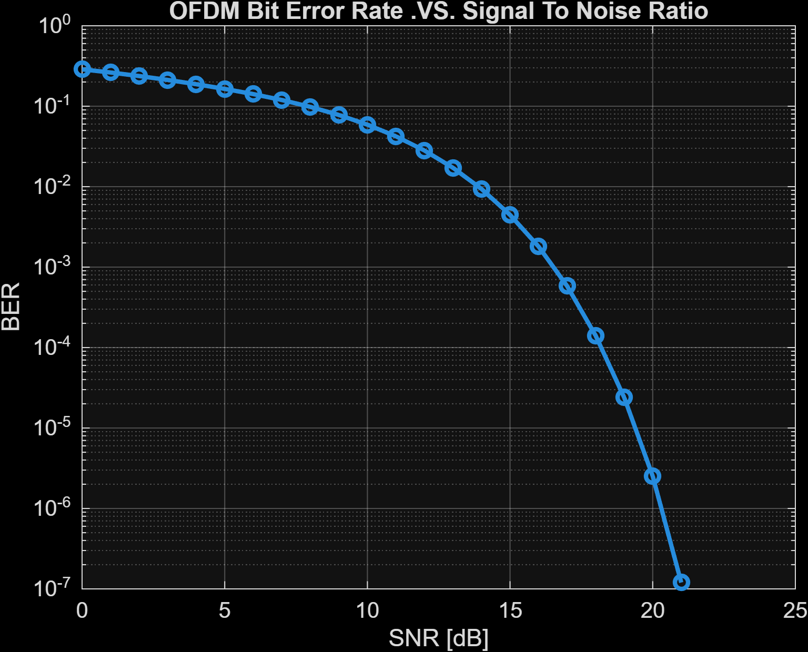
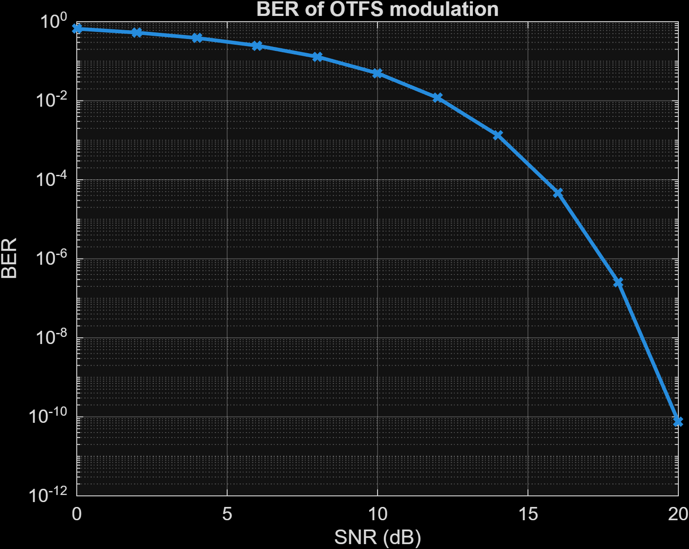
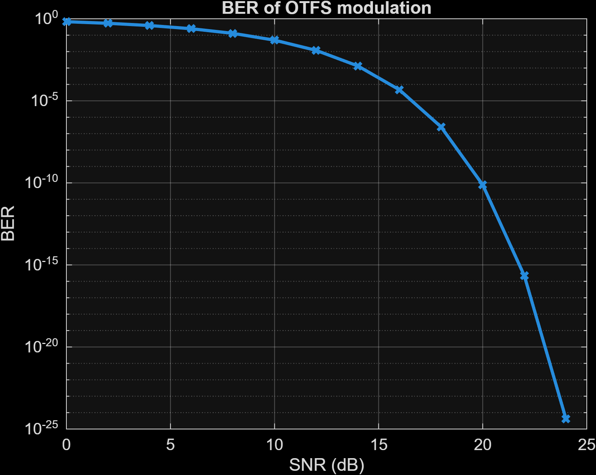
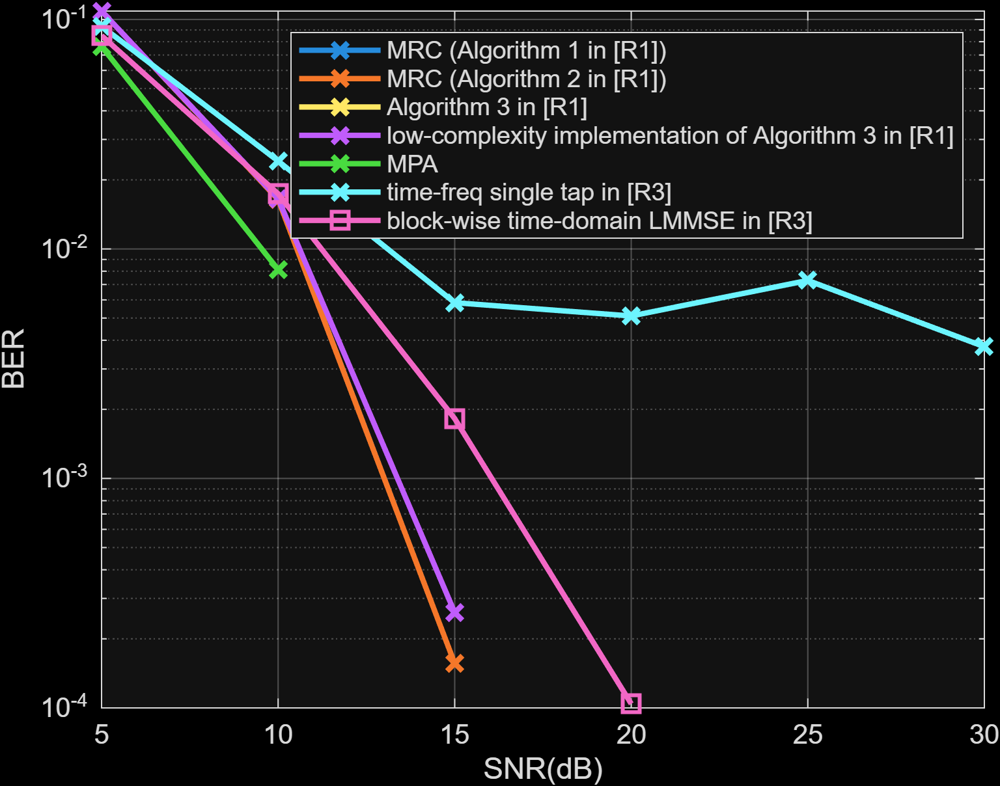

# OTFS-based UAV Swarm Communication

> **MATLAB simulations for OTFS vs OFDM modulation, detection algorithms, and trajectory optimization in UAV swarm networks**

[](https://www.mathworks.com/products/matlab.html)
[](LICENSE)

---

##  Overview

This repository contains MATLAB simulation code for analyzing **Orthogonal Time Frequency Space (OTFS)** modulation in **UAV swarm communication systems**. OTFS is a next-generation waveform that operates in the **delay-Doppler domain**, making it inherently robust to the high-mobility, high-Doppler channels encountered in UAV-to-UAV and UAV-to-ground links.

The project includes:
- **BER performance comparison** of OTFS vs conventional OFDM under Rician fading channels
- **Detection algorithm benchmarking** — LMMSE, MRC, and MPA detectors
- **Parametric studies** — impact of swarm radius, number of UAVs, zero-padding length, and subcarrier count on BER
- **3D UAV swarm trajectory simulation** with kinematic constraints
- **DDPG-based Joint Trajectory & Frequency Reuse (JTFR)** routing framework comparison

---

##  Repository Structure

```
├── simulations/                     # Core BER simulations
│   ├── otfs_vs_ofdm_ber.m           # Monte Carlo BER: OTFS vs OFDM (Rician channel, QPSK)
│   ├── otfs_ber.m                   # Modular OTFS BER function
│   ├── ofdm_ber.m                   # Modular OFDM BER function (16-QAM)
│   └── compare_otfs_ofdm.m          # Side-by-side comparison driver script
│
├── detection/                       # Detection algorithm comparison
│   └── detection_schemes.m          # LMMSE, MRC, MPA detection BER comparison
│
├── parametric_studies/              # Parameter sweep studies
│   ├── ber_vs_radius_uav.m          # 3D surface: BER vs Radius × UAV nodes (ZP=4/8)
│   └── ber_vs_snr_radius_uav.m      # BER vs SNR, Radius, UAVs, and subcarrier count
│
├── uav_swarm/                       # UAV swarm dynamics
│   ├── uav_trajectory_3d.m          # 3D trajectory simulation with velocity/acceleration limits
│   └── jtfr_routing.m               # DDPG-based JTFR routing performance comparison
│
├── docs/figures/                    # Output figures and result plots
│   ├── Compare_OFDM_and_OTFS.png    # OFDM vs OTFS BER comparison
│   ├── OFDM_BER.png                 # OFDM BER vs SNR curve
│   ├── OTFS_BER_comparison.png      # OTFS BER vs SNR (0–20 dB)
│   ├── OTFS_BER_individual.png      # OTFS BER vs SNR (0–24 dB)
│   └── detection_output.png         # 7 detection algorithms BER comparison
│
├── .gitignore
├── LICENSE
└── README.md
```

---

##  Getting Started

### Requirements

- **MATLAB R2021b** or later
- **Communications Toolbox** (for `qammod`, `qamdemod`, `awgn`, `biterr`)
- **Signal Processing Toolbox** (for `qfunc`)

### Running the Simulations

Open MATLAB, navigate to the repository root, and run any script directly:

```matlab
%% 1. OTFS vs OFDM BER (main simulation)
run('simulations/otfs_vs_ofdm_ber.m')

%% 2. Modular comparison (calls otfs_ber.m and ofdm_ber.m)
run('simulations/compare_otfs_ofdm.m')

%% 3. Detection schemes benchmark (LMMSE, MRC, MPA)
run('detection/detection_schemes.m')

%% 4. Parametric study: BER vs Radius & UAV nodes (3D surface)
run('parametric_studies/ber_vs_radius_uav.m')

%% 5. Parametric study: BER vs SNR, Radius, UAVs
run('parametric_studies/ber_vs_snr_radius_uav.m')

%% 6. UAV swarm 3D trajectory visualization
run('uav_swarm/uav_trajectory_3d.m')

%% 7. JTFR routing performance comparison
run('uav_swarm/jtfr_routing.m')
```

---

##  Key Simulation Parameters

### OTFS vs OFDM BER Simulation (`otfs_vs_ofdm_ber.m`)

| Parameter | Value |
|---|---|
| OTFS Time Symbols (*N*) | 32 |
| Subcarriers (*M*) | 64 |
| Subcarrier Spacing (Δ*f*) | 30 kHz |
| Carrier Frequency (*f*c) | 15 GHz |
| Modulation | QPSK |
| Number of UAVs (*U*) | 16 |
| Swarm Radius (*R*) | 500 m |
| Max UAV Speed (*v*max) | 50 m/s |
| Rician K-factor | 5 dB |
| Zero Padding (ZP) | 4 |
| SNR Range | 0 – 30 dB |
| Monte Carlo Iterations | 10⁵ |

### Detection Schemes (`detection_schemes.m`)

| Parameter | Value |
|---|---|
| Channel Paths (*L*) | 6 |
| Max Doppler Speed | 300 m/s |
| Detection Methods | LMMSE, MRC, MPA |
| Frames per SNR | 100 |

### UAV Swarm Trajectory (`uav_trajectory_3d.m`)

| Parameter | Value |
|---|---|
| Number of UAVs | 10 |
| Mission Area | 2500 × 2500 m |
| Altitude Range | 100 – 400 m |
| Max Speed | 20 m/s |
| Max Acceleration | 5 m/s² |
| Simulation Time | 1000 s |

---

##  Sample Results

### OFDM vs OTFS — BER Comparison

<p align="center">
  
</p>

*BER vs SNR comparison showing OTFS achieves lower BER than OFDM at higher SNR, demonstrating its superior performance in high-Doppler UAV channels.*

---

### OFDM BER Performance

<p align="center">
  
</p>

*OFDM Bit Error Rate vs Signal-to-Noise Ratio under multipath fading conditions.*

---

### OTFS BER Performance

<p align="center">
  
</p>

*OTFS BER vs SNR (0–20 dB range) showing steep BER decline characteristic of delay-Doppler domain processing.*

<p align="center">
  
</p>

*OTFS BER vs SNR over extended range (0–24 dB), demonstrating BER performance down to 10⁻²⁵ at high SNR.*

---

### Detection Algorithm BER Comparison

<p align="center">
  
</p>

*BER vs SNR comparison of seven OTFS detection schemes: MRC (Algorithms 1 & 2), Algorithm 3, low-complexity Algorithm 3, MPA, time-frequency single-tap equalizer, and block-wise time-domain LMMSE.*

---

##  Technical Background

### OTFS Modulation

OTFS operates in the **delay-Doppler domain** rather than the conventional time-frequency domain used by OFDM. This provides:

- **Full diversity** over both time and frequency — each symbol spreads across the entire bandwidth and time duration
- **Resilience to Doppler** — high-mobility scenarios (UAVs at 50–300 m/s) that cripple OFDM are handled naturally
- **Sparse channel representation** — the delay-Doppler channel is quasi-static and sparse, enabling efficient equalization

### Signal Flow

```
              ISFFT              Heisenberg
DD Domain  ────────►  TF Domain  ──────────►  Time Domain  ──► Channel
  x[k,l]               X[n,m]                   s(t)          ──► + noise
                                                                    │
              SFFT              Wigner                              ▼
DD Domain  ◄────────  TF Domain  ◄──────────  Time Domain  ◄── Received
 y[k,l]                Y[n,m]                   r(t)
```

### Channel Model

The UAV-to-UAV channel is modeled as a **Rician fading channel** with:
- **LoS component** — direct path between UAVs (dominant at shorter swarm radii)
- **NLoS component** — scattered multipath (Rayleigh distributed)
- **Delay spread** proportional to swarm radius *R*
- **Doppler spread** determined by UAV velocity and carrier frequency

---


##  License

This project is licensed under the **MIT License** — see the [LICENSE](LICENSE) file for details.

---